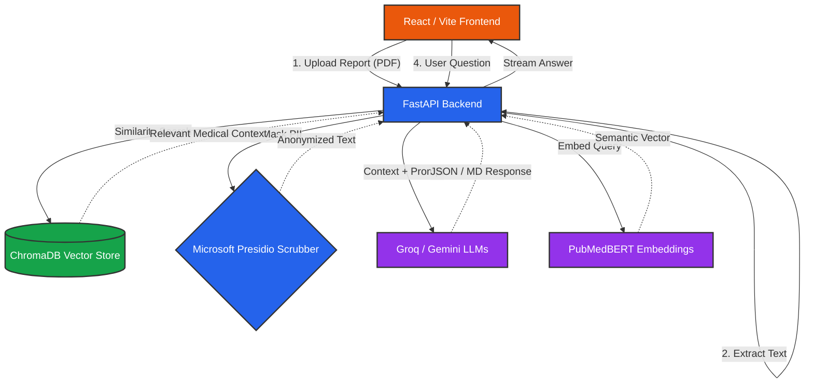

# ⚕️ MedScan AI
<div align="center">
  
  <p><b>HIPAA-Compliant Hybrid RAG Medical Report Analyzer</b></p>
</div>

MedScan AI is a sophisticated full-stack AI application designed to parse, anonymize, and semantically analyze diagnostic lab reports. It uses a **Hybrid Retrieval-Augmented Generation (RAG)** architecture with domain-specific embeddings (PubMedBERT) and semantic search (ChromaDB) to accurately answer questions about complex medical data.

---

## 🌟 Key Features

*   **📄 Medical PDF Parsing:** Robust extraction of tabular lab data and unstructured clinical text.
*   **🛡️ PII Scrubbing (HIPAA Compliance):** Uses Microsoft Presidio to automatically detect and mask Personal Identifiable Information (Names, SSNs, Patient IDs) before data ever touches an external LLM.
*   **🧠 Hybrid RAG Architecture:** 
    *   **Vector Search:** Employs `PubMedBERT` embeddings in ChromaDB to find semantically similar medical context.
    *   **Keyword Search:** Uses BM25 for precise vocabulary matching (e.g., exact chemical abbreviations).
*   **📊 Agentic Dashboard:** A modern, beautiful React interface featuring dynamic biomarker gauges, animated statistics, and a persistent markdown-enabled chat.
*   **📈 RAGAS Evaluation Pipeline:** Automated CI/CD script to evaluate RAG answer faithfulness and context precision using the `ragas` framework.

---

## 🏗️ System Architecture



---

## 🖼️ Dashboard Preview

<div align="center">
  
</div>

---

## 🛠️ Technology Stack

| Component | Technologies Used |
| :--- | :--- |
| **Frontend** | React 18, Vite, Tailwind-inspired CSS styling |
| **Backend** | Python 3.11, FastAPI, Uvicorn |
| **Vector DB** | ChromaDB (Persistent) |
| **Embeddings** | `pritamdeka/S-PubMedBert-MS-MARCO` (Medical specific) |
| **LLM Inference** | Groq (Llama-3), Google Gemini (2.0 Flash) |
| **Privacy / NLM** | Microsoft Presidio, spaCy (`en_core_web_sm`) |
| **Evaluation** | RAGAS (Retrieval Augmented Generation Assessment) |

---

## 🚀 Local Setup & Installation

### Option 1: Docker (Easiest)

If you have Docker installed, you can spin up both the React frontend and FastAPI backend with a single command:

```bash
git clone https://github.com/your-username/MedScan-AI.git
cd MedScan-AI

# Rename environment file and fill in your keys
cp backend/.env.example backend/.env

# Start the cluster
docker-compose up --build
```
*   Frontend will be available at: `http://localhost:80`
*   Backend API will be available at: `http://localhost:8000`

### Option 2: Standard Installation

**1. Clone & Setup Backend**
```bash
git clone https://github.com/your-username/MedScan-AI.git
cd MedScan-AI/backend

# Create virtual environment
python -m venv venv
source venv/Scripts/activate  # Windows: venv\Scripts\activate

# Install dependencies
pip install -r requirements.txt

# Start the API
uvicorn app.api.main:app --reload
```

**2. Setup Frontend**
```bash
cd ../frontend
npm install
npm run dev
```

---

## 📝 License

This project is licensed under the MIT License - see the LICENSE file for details.

---

> **Note on Deployment:** The full `PubMedBERT` stack requires a machine with at least 2GB of RAM. If deploying on a 512MB free-tier (like Render), swap the embedding model in `config.py` to `all-MiniLM-L6-v2` or use heavily quantized APIs.
