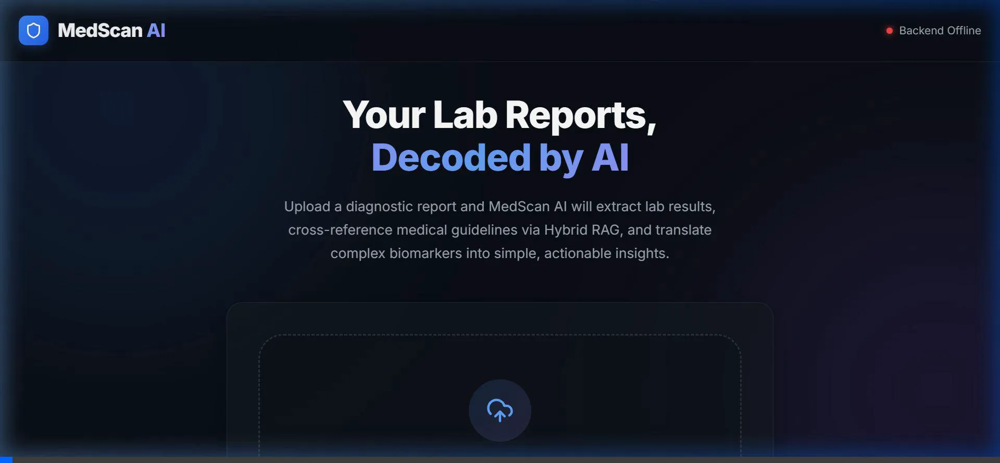
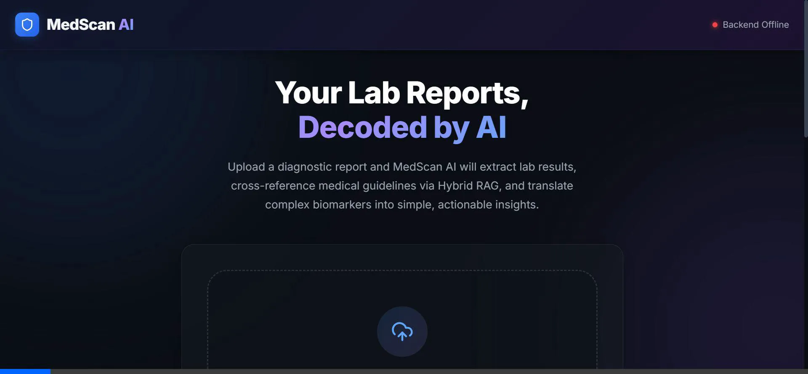
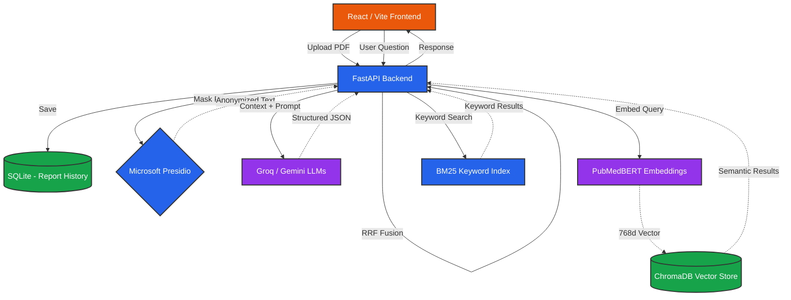

# ⚕️ MedScan AI

<div align="center">
  
  <br/><br/>
  <b>An AI-powered medical report analyzer that turns confusing lab reports into plain-English insights.</b>
  <br/>
  Built with Hybrid RAG · PubMedBERT · Microsoft Presidio · FastAPI · React
</div>

---

## 💡 Why I Built This

Every time I got a blood test back, I'd stare at rows of numbers — "MCHC 31.2 g/dL", "TSH 6.8 µIU/mL" — and have no idea what any of it meant. I'd end up Googling each value, getting scared by WebMD, and then waiting days for a doctor's appointment just to hear "it's fine."

I thought: **what if an AI could read the entire report, understand what's abnormal, pull in real medical context, and explain it to me like a human would?**

That's MedScan AI. You upload a lab report PDF, and it:
1. **Extracts** every test result (even from messy, multi-format PDFs)
2. **Scrubs** your personal info before anything touches an LLM  
3. **Looks up** each abnormal result against a curated medical knowledge base
4. **Explains** what's going on in plain English with lifestyle tips

No more Googling "is my creatinine high" at 2 AM.

---

## 🖼️ What It Looks Like

<div align="center">
  
  <p><i>The dashboard after analyzing a blood test — biomarker gauges, AI-generated summary, and an interactive chat to ask follow-up questions.</i></p>
</div>

---

## 🔬 How It Actually Works (The Pipeline)

When you upload a PDF, here's exactly what happens under the hood:

```
PDF Upload
    │
    ▼
┌─────────────────────────────┐
│  1. PDF EXTRACTION          │  pdfplumber extracts text + tables
│     (pdfplumber)            │  Falls back to Gemini Vision for scanned PDFs
└─────────────┬───────────────┘
              │
              ▼
┌─────────────────────────────┐
│  2. PII SCRUBBING           │  Microsoft Presidio masks names, phone numbers,
│     (Presidio + spaCy)      │  SSNs, emails — BEFORE the text reaches any LLM
└─────────────┬───────────────┘
              │  "Patient: <PERSON>, Ph: <PHONE_NUMBER>"
              ▼
┌─────────────────────────────┐
│  3. LLM PARSING             │  The LLM reads the messy text and extracts
│     (Gemini / Groq)         │  structured data: test names, values, units,
│                             │  reference ranges, status (High/Low/Normal)
└─────────────┬───────────────┘
              │  Structured JSON (validated by Pydantic)
              ▼
┌─────────────────────────────┐
│  4. HYBRID RAG RETRIEVAL    │  For each abnormal result, we query:
│     Dense: ChromaDB +       │   → PubMedBERT vectors (semantic meaning)
│            PubMedBERT       │   → BM25 keyword index (exact medical terms)
│     Sparse: BM25            │  Results fused via Reciprocal Rank Fusion
└─────────────┬───────────────┘
              │  Relevant medical context from 17 biomarker guides
              ▼
┌─────────────────────────────┐
│  5. RAG-GROUNDED ANALYSIS   │  The LLM generates a patient-friendly summary
│     (Gemini / Groq)         │  using ONLY the retrieved medical context.
│                             │  No hallucination — every tip is traceable.
└─────────────┬───────────────┘
              │
              ▼
        Dashboard UI
   (gauges, chat, summary)
```

---

## 🧠 The Technical Details

### Why Hybrid RAG? (Not Just Vector Search)

Standard vector search works great for general questions, but medical queries are different. If a patient asks about "MCHC" or "RDW-CV", a dense embedding model might not have strong representations for these abbreviations — it dilutes them into general "blood test" semantics.

My solution: **combine two retrieval strategies and fuse them.**

| Strategy | Good At | Example |
|:---|:---|:---|
| **Dense (PubMedBERT + ChromaDB)** | Semantic similarity — understanding intent | "I feel tired all the time" → retrieves hemoglobin, iron, B12 docs |
| **Sparse (BM25)** | Exact keyword matching | "MCHC 31.2" → retrieves the exact MCHC biomarker guide |

The results are combined using **Reciprocal Rank Fusion (RRF)**, which gives a fair score to documents that appear in both lists.

### Why PubMedBERT? (Not Generic Embeddings)

General models like `all-MiniLM-L6-v2` don't know that "HbA1c" is related to "diabetes management" or that "eGFR" is about kidney function. I use [`pritamdeka/S-PubMedBert-MS-MARCO`](https://huggingface.co/pritamdeka/S-PubMedBert-MS-MARCO), which was trained on biomedical literature and understands medical vocabulary natively.

### PII Scrubbing — Why It Matters

Before any text is sent to Gemini or Groq, Microsoft Presidio scans and masks all personal identifiers:

```
Before: "Patient Name: Rahul Singh, Phone: 9876543210, DOB: 15/03/1995"
After:  "Patient Name: <PERSON>, Phone: <PHONE_NUMBER>, DOB: 15/03/1995"
```

**Important design choice:** Age, DOB, and Gender are intentionally *not* scrubbed. The AI needs these to contextualize results correctly — hemoglobin reference ranges for a 12-year-old are very different from those of a 50-year-old adult.

### The LLM Parser (Instead of Regex)

Most lab report parsers use regex, which breaks the moment you switch from a Lal PathLabs report to an Apollo or Thyrocare format. Instead, I use the LLM itself as a **semantic parser** — it reads unstructured text and extracts structured JSON, validated by Pydantic schemas. The prompt engineering *is* the parsing logic, and it handles format variability gracefully.

### RAGAS Evaluation

I don't just trust the RAG pipeline blindly. The project includes a [`scripts/evaluate_rag.py`](backend/scripts/evaluate_rag.py) script that uses the [RAGAS](https://docs.ragas.io/) framework to measure:

- **Faithfulness** — Is the answer grounded in the retrieved context?
- **Answer Relevancy** — Does the answer actually address the question?
- **Context Precision** — Did we retrieve the right documents?
- **Context Recall** — Did we retrieve *enough* of the right documents?

---

## 🏗️ Architecture Diagram



---

## 🛠️ Tech Stack

| Layer | Technology | Why I Chose It |
|:---|:---|:---|
| **Frontend** | React 18, Vite | Fast HMR, modern DX |
| **Backend** | Python 3.11, FastAPI | Async-first, auto-generated API docs |
| **Vector DB** | ChromaDB (Persistent) | Lightweight, no server needed, Python-native |
| **Embeddings** | `S-PubMedBert-MS-MARCO` | Domain-specific medical embeddings |
| **Sparse Search** | BM25 (rank-bm25) | Exact keyword matching for medical abbreviations |
| **LLM** | Groq (Llama 4 Scout), Gemini 2.0 Flash | Provider-agnostic client — switch with 1 env var |
| **Privacy** | Microsoft Presidio + spaCy | Enterprise-grade PII detection |
| **Evaluation** | RAGAS | Industry-standard RAG quality metrics |
| **Database** | SQLite + SQLAlchemy | Simple persistence for report history |
| **Containerization** | Docker + Docker Compose | One-command deployment |

---

## 📁 Project Structure

```
MedScan-AI/
├── backend/
│   ├── app/
│   │   ├── api/
│   │   │   ├── main.py              # FastAPI app factory + CORS + health check
│   │   │   └── routes/
│   │   │       ├── reports.py        # Upload → Extract → Scrub → Parse → Analyze
│   │   │       └── chat.py           # Follow-up Q&A over analyzed reports
│   │   ├── core/
│   │   │   ├── config.py             # Pydantic settings (env-driven, validated at startup)
│   │   │   ├── db.py                 # SQLAlchemy engine + session
│   │   │   └── db_models.py          # PatientReport model
│   │   ├── services/
│   │   │   ├── pdf_extractor.py      # pdfplumber + Gemini Vision fallback
│   │   │   ├── pii_scrubber.py       # Presidio-based PII masking
│   │   │   ├── report_parser.py      # LLM-as-parser (prompt-engineered JSON extraction)
│   │   │   ├── report_analyzer.py    # RAG-grounded analysis orchestrator
│   │   │   ├── rag_engine.py         # Hybrid retrieval (Dense + Sparse + RRF)
│   │   │   ├── vector_store.py       # ChromaDB + PubMedBERT embeddings
│   │   │   └── llm_client.py         # Provider-agnostic LLM client (Gemini/Groq/Ollama)
│   │   ├── knowledge/
│   │   │   ├── biomarker_info/       # 17 curated medical guides (CBC, lipid, thyroid, etc.)
│   │   │   ├── lifestyle_tips/       # Actionable health recommendations
│   │   │   └── reference_ranges.json # Structured normal ranges by age/gender
│   │   ├── schemas/                  # Pydantic models (LabReport, TestResult, Analysis)
│   │   └── utils/
│   │       └── logger.py             # Loguru-based structured logging
│   ├── scripts/
│   │   ├── evaluate_rag.py           # RAGAS evaluation pipeline
│   │   ├── compare_embeddings.py     # PubMedBERT vs generic embedding comparison
│   │   └── generate_kb.py            # Knowledge base generation script
│   ├── tests/                        # Unit + integration tests
│   ├── Dockerfile
│   ├── requirements.txt
│   └── .env.example
├── frontend/
│   ├── src/
│   │   ├── App.jsx                   # Main shell + health check indicator
│   │   ├── components/
│   │   │   ├── FileUploadView.jsx    # Landing page + PDF upload + progress animation
│   │   │   └── DashboardView.jsx     # Stats, biomarker gauges, markdown chat
│   │   └── index.css                 # Full design system (warm hybrid theme)
│   ├── Dockerfile
│   └── nginx.conf
├── docker-compose.yml
└── README.md
```

---

## 🚀 Getting Started

### Prerequisites
- Python 3.11+
- Node.js 18+
- A free API key from [Google AI Studio](https://aistudio.google.com/apikey) (Gemini) or [Groq Console](https://console.groq.com/keys)

### 1. Clone the repo
```bash
git clone https://github.com/rahulsgh21/MedScan-AI.git
cd MedScan-AI
```

### 2. Set up the backend
```bash
cd backend

# Create and activate a virtual environment
python -m venv venv
venv\Scripts\activate        # Windows
# source venv/bin/activate   # Mac/Linux

# Install dependencies
pip install -r requirements.txt

# Download the spaCy language model (needed for PII detection)
python -m spacy download en_core_web_sm

# Set up your environment variables
copy .env.example .env       # Windows
# cp .env.example .env       # Mac/Linux
```

Now open `backend/.env` and paste in your API keys:
```env
LLM_PROVIDER=groq                    # or "gemini"
GEMINI_API_KEY=your_key_here
GROQ_API_KEY=your_key_here
```

### 3. Start the backend
```bash
uvicorn app.api.main:app --reload
```
The API will be running at `http://localhost:8000`. You can check the auto-generated docs at `http://localhost:8000/docs`.

### 4. Set up the frontend (in a new terminal)
```bash
cd frontend
npm install
npm run dev
```
The frontend will be live at `http://localhost:5173`.

### 5. Upload a report
Open `http://localhost:5173`, drag in a lab report PDF, and watch the magic happen.

---

### 🐳 Or Just Use Docker

If you have Docker installed, skip all the above and run:
```bash
# Copy your env file first
copy backend/.env.example backend/.env
# Edit backend/.env with your API keys

docker-compose up --build
```
- Frontend: `http://localhost:80`
- Backend: `http://localhost:8000`

---

## 🧪 Running the RAGAS Evaluation

To evaluate how well the RAG pipeline is performing:
```bash
cd backend
python scripts/evaluate_rag.py
```

This will:
1. Run medical questions through the full Hybrid RAG pipeline
2. Use Gemini as an impartial judge to score faithfulness, relevancy, precision, and recall
3. Save a detailed CSV to `backend/ragas_eval_results.csv`

---

## 🗺️ What I'd Build Next

- [ ] **PDF Export** — Let users download their analysis as a clean PDF report
- [ ] **Multi-language support** — Hindi, Tamil, etc. for Indian lab reports  
- [ ] **Report comparison** — "How has my cholesterol changed since last year?"
- [ ] **Doctor handoff** — Generate a concise clinical summary for the patient's physician

---

## 📄 License

This project is licensed under the MIT License.

---

> **A note on deployment:** The full PubMedBERT stack needs ~2GB RAM to run comfortably. Most 512MB free-tier cloud platforms (like Render) can't handle it. If you want to deploy this for cheap, swap the embedding model in `config.py` to `all-MiniLM-L6-v2` — you'll lose some medical-specific accuracy but it'll run anywhere.
